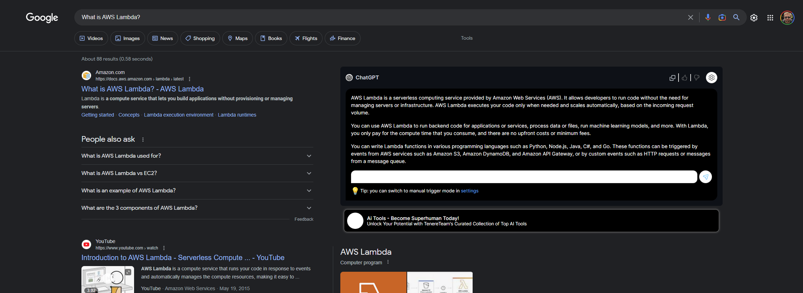

# tampermonkey-scripts

A collection of my Tampermonkey user scripts

## Installation and Usage

To use these scripts, follow these steps:

1. Install the Tampermonkey browser extension
2. Open the extension
3. Add a new user script
4. Copy one of my scripts and paste it into the new user script
5. Save the user script
6. Navigate to the respective page(s) and enjoy!

## Screenshots

 

### wide-google-search-textbox

 

#### BEFORE

#### AFTER

 

### wide-chatgpt-for-search-engines

 

#### BEFORE

#### AFTER

 

### wide-chatgpt

 

#### BEFORE

#### AFTER

